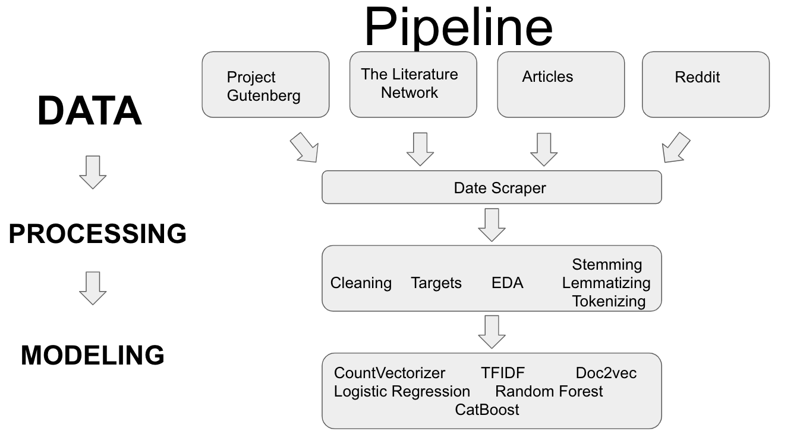
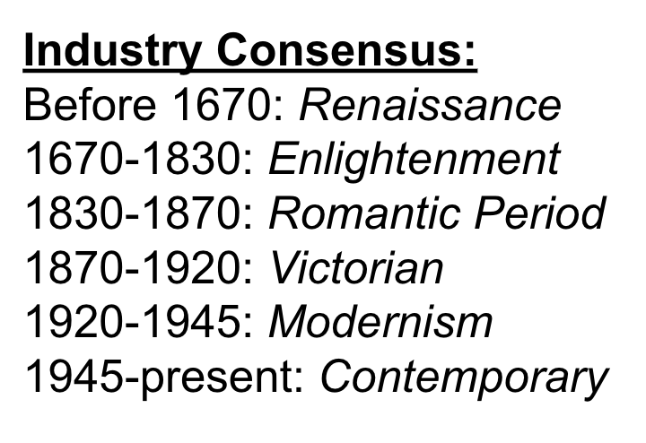
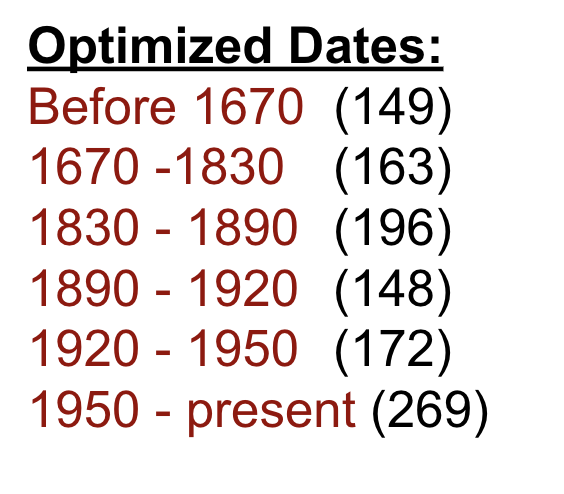
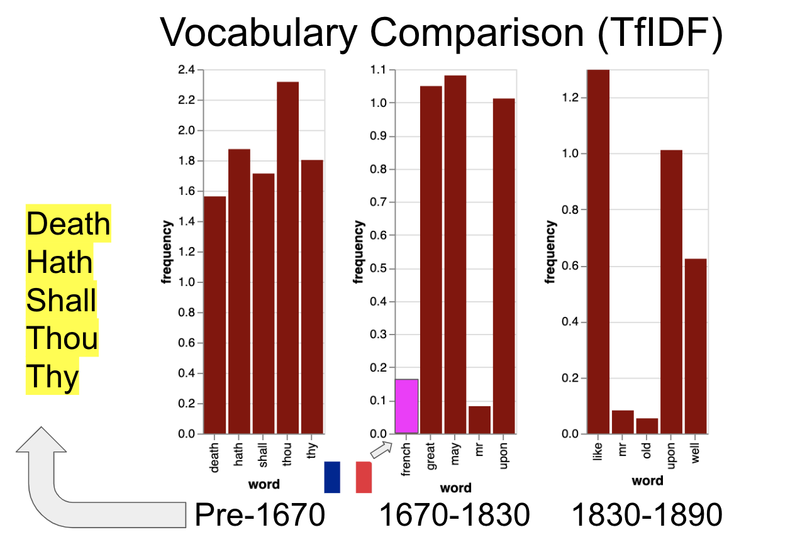
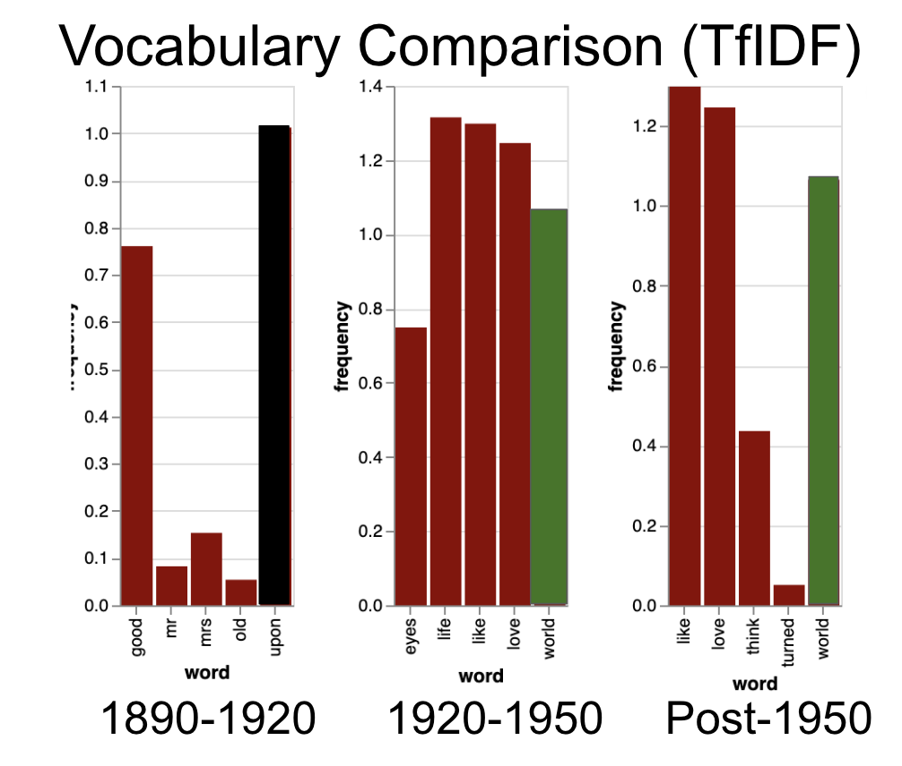
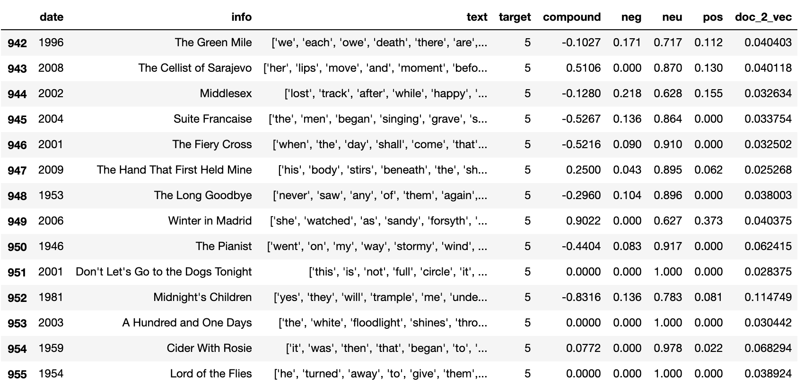
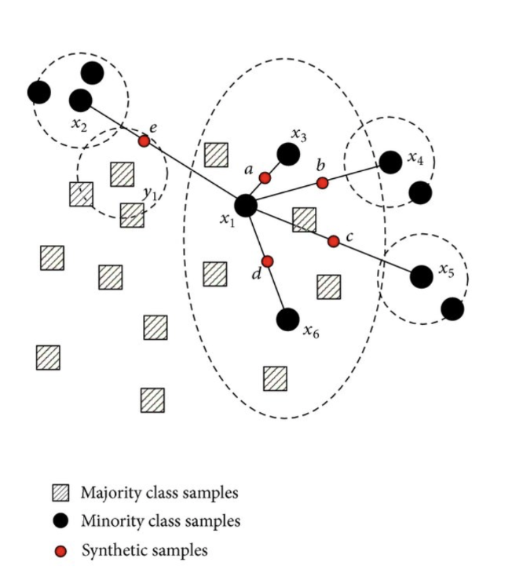
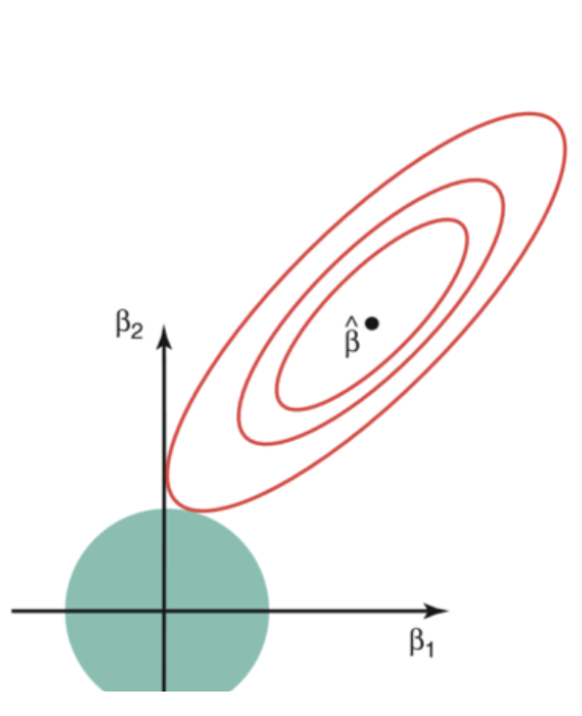
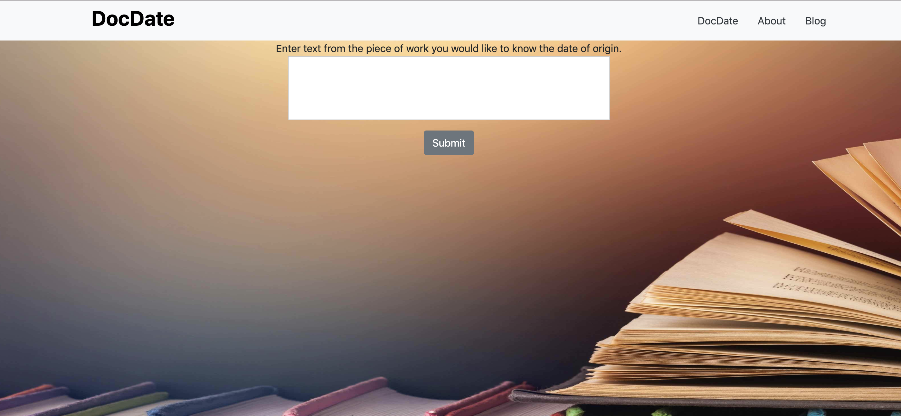

# Time Period Prediction Based on NLP

My project will take excerpts from books from various time periods and predict when they were written. The final model will
analyze text from similar time periods for similarities in both vocabulary and style. The final web app will accept an excerpt from a piece of work and predict what time period the writing was produced. To narrow the scope, I have decided to first focus primarily on Fiction works. In the future I hope to widen the scope and extend this model to predict on Non-Fiction as well.

# Motivation

The usefulness of this model will be its ability to aid in the dating of historical documents. Archives and manuscript collections are known for the bevy of unlabeled documents. This is particularly the case for private archive collections. This is why private collections, for example Transcribe Bentham and Transkribus, have led the way in Optical Character Recognition (OCR) and Handwriting Text Recognition (HTR) developments in the last ten years. These development have alleviated some of these concerns, however, loose documents still need academics with domain expertise to provide dates and then context. A model that could predict time period, would alleviate the pressure on these professionals, providng them more time for analysis. Furthermore, dated documents will aid archivists in better sorting documents for future use by researchers. On a greater level, this model will provide us with a greater understanding of our language and its evolution over the last hundreds of years.

# Process

# Data

Data collection was by far the most challenging part of this study. I started with 30,000 text documents scraped from Project Gutenberg. I quickly realised that many of the text documents did not have dates, and even more did not have proper dates (ie. Second, Third, and Fourth publications of books). I then supplemented my initial data set with works from The Literature Network. Since both of these sites focus primarily on books that are out of publication, they were all created pre-1920. In order to balance the dataset, I had to get creative, and find excerpts from more modern and contemporary books. These excerpts were provided by scraping Reddit (redditors' favourite book excerpts of all time) and a couple Magazine articles on best excerpts from the passed 100 years. After concatenating all these scrapings, my job was dataframe was almost done. The next hurdle I needed to jump was the fact that I had excerpts, but no targets. This was solved by creating a webscraper with Selenium that was able to repeatedly ask Google.com, Ask.com, and DuckDuckGo.com "when was {book} published?" After cleaning (and manually confirming) dates, I have a dataset ready for processing.

# Targets

Now that I had dates, courtesy of my Selenium scraper, I was able to start thinking of how I would bin publication dates into time periods. When I first started my project, I decided to go with time periods of Literature generally accepted in the Literary field:

I quickly realized that it was possible to optimize my targets, by letting the data speak for itself. I created an optimization function (with a Logisitic regression or RandomForest model using countvectorizer or tfidf vectors) that looped through possible binning dates and found that the there was a better set of targets:

By shifting the target dates 20-30 years earlier/later, I could set targets more reflective of the data. The final dates performed decently well on all combinations of vectors and models, while taking imbalance into account.

# Text preparation and EDA

First, I prepared all the data for modeling. This included stemming, lemmatizing, using regex, and lowercasing.

Second, I looked at the most common unigrams and bigrams with countvectorizer. I also looked at Tfidf to see words that were common in certain time periods in contrast to the whole corpus. These analyses allowed me a glimpse into how vocabulary has evolved over the last 400 years.

Hath, Thou, Shall, and Thy are words that automatically make someone think of Shakespearean era literature. And the idea that France is frequent in the 1670-1830 period should be of no surpise to history buffs who know that England and France were in constant warfare in this period.

The use of the word 'upon' is frequent through the middle targets, and drops out around 1920, and the rise of 'world' in the last 100 years evokes ideas of humans becoming more 'worldly' and the rise of Science Fiction and themes of distopian worlds.

Third, I used LDA on the separate targets to find common themes, and I used Vadar for some sentiment analysis. If we were to compare the time periods as a whole against one another I could see some differences in composite, positive, neutral, and negative means, but sentiment analysis did not provide much predictive power for individual texts. 

# Modeling

I attempted many different models. I vectorized with CountVectorizer and Tfidf and modeled with Logistic Regression and RandomForest. I used Doc2Vec. I also feature engineered, creating a dataset with sentiment analysis features and polarity Doc2Vec score. I attempted to Catboost with these features (concatenated with Tfidf matrix). 

All of these models scored somewhere between 50 and 65% in Accuracy. In the end, and not surprisingly, the most predictive feature in text for predicting time period was the vocabulary. The best model was a basic Logistic Regression using CountVectorizer. 

# Final Model

As is to be expected with a dataset with relatively few data points (1097) in comparision to features (nearly 150,000), the naive model was extremely overfit. The model was training at 100% accuracy and testing at 49% accuracy. Moreover, the model was over-predicting the majority class. The 1950-present target had 29% precision and 100% recall. 

First I decided to use scikit-learn imblance learn to rebalance the data. I decided to use SMOTE (Synthetic Minority Over-sampling Tecnique) because a) with such a small dataset to begin with, I did not want to undersample the majority class and lose valuable information and b) the ratio between the minority and majority classes was not large enough for Adasyn and SMOTE performed better than BorderlineSMOTE.

Second, I have to deal with the overfitting. USing regularization, I was able to downscale the common words, and accenturate the informative words resulting in a better test score. Using a gridsearchCV, I found that regularization using Ridge Regression (L2) with alpha set to .001, resulted in lower train score around 81% and test score raising to 73%. 

#  Accuracy  

Each time period has precision scores above 60% and recall scores about 70%, which is decent for a 6 classification model. The biggest take away, was that the model had difficulty predicting between neighbouring targets. Over 80% of miscategorised items belonged to a neighbouring category. This shows a limitation to created a classification model attempting to predict dates. Inevitably borderline dates will be miscategorized. However, in the end, the biggest takeaway is that using Natural Language Processing, it is possible to predict roughly when a piece of literatue was publshed.

# Web App

The final web application, hosted on AWS, take in an excerpt from a book and returns a prediction on the time period it was created.

www.docdate.ca/home

