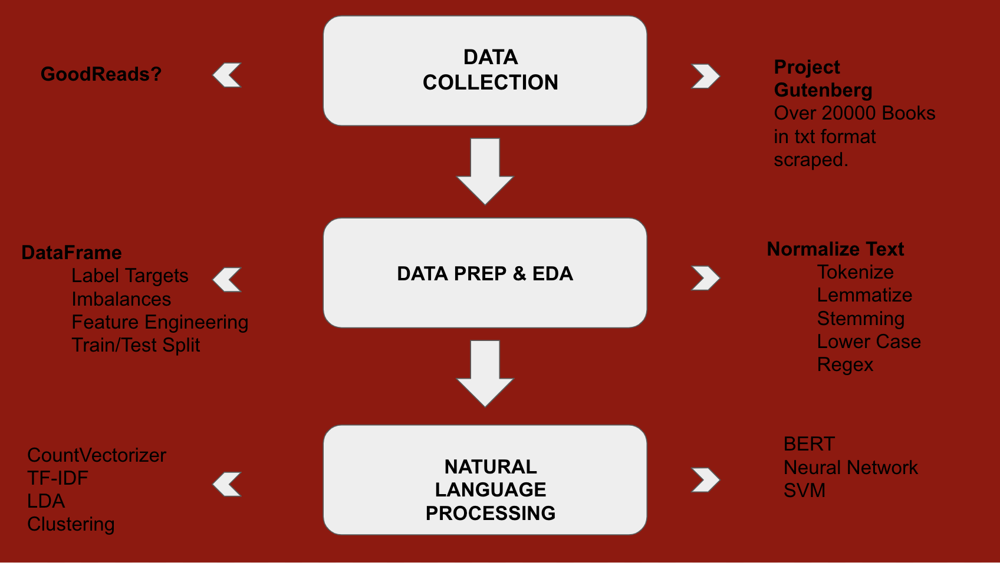

# Time Period Prediction Based on NLP

My project will take excerpts from books from various time periods and predict when they were written. The final app will
analyze documents from similar time periods for similarities in both vocabulary and style.

# Motivation

The usefulness of this model will be its ability to aid in the dating of historical documents. Archives and manuscript collections are known for the bevy of unlabeled documents. Even after OCR and HTR systems, loose documents still need academics with domain expertise to provide dates and then context. Furthermore, on a greater level, this model with provide us with a greater understanding of our language and its evolution over the last hundreds of years.

# Data

I currently have over 20,000 text documents scraped from Project Gutenberg. I am in the process of extracting excerpts from
the text files as well as detailed information, including Author and Title, and most importantly, the date of publication.
Some of these files do not have this information, so a second source may be needed to supplement the Project Gutenberg data.

# Process

# Modeling

The project will attempt to use many different NLP models, including:
<<<<<<< HEAD
CountVectorizer
TF-IDF
LDA
Clustering
Word2Vec
BERT
Neural Network
SVM
=======

                    CountVectorizer
                    TF-IDF
                    LDA
                    Clustering
                    Word2Vec
                    BERT
                    Neural Network
                    SVM

>>>>>>> 8a8869cbcd8de82707b014fca3144ff64ebddd90
