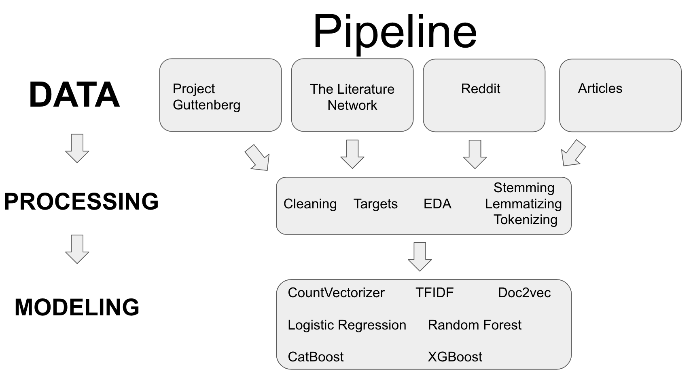

# Time Period Prediction Based on NLP

My project will take excerpts from books from various time periods and predict when they were written. The final model will
analyze documents from similar time periods for similarities in both vocabulary and style. The flask app will accept an excerpt from a piece of work
and predict what time period the writing came from.

# Motivation

The usefulness of this model will be its ability to aid in the dating of historical documents. Archives and manuscript collections are known for the bevy of unlabeled documents. Even after OCR and HTR systems, loose documents still need academics with domain expertise to provide dates and then context. Furthermore, on a greater level, this model will provide us with a greater understanding of our language and its evolution over the last hundreds of years.

# Data

I started with 30,000 text documents scraped from Project Gutenberg. I quickly realised that many of the text documents did not have dates, and even more did not have proper dates (ie. Second, Third, and Fourth publications of books). I then supplemented my initial data set with works from The Literature Network (which had dates!) and then also Sub-reddits about redditors' favourite book excerpts of all time, as well as, Magazine articles on best excerpts from the passed 100 years.

# Process

# Targets

When I first started my project, I decided to go with time periods of Literature generally accepted in the Literary field:

                      Before 1670: Renaissance
                      1670-1800: Enlightenment
                      1830-1870: Romantic Period
                      1870-1920: Victorian (Realism and Naturalism)
                      1910-1945: Modernism
                      1945-present: Contemporary

I quickly realized that it was possible to optimize my targets, by letting the data speak for itself. I created a optimization function (located in script/EDA) that looped through possible binning dates and found that the there was a better set of targets:

                      Before 1670
                      1670-1830
                      1830-1890
                      1890-1920
                      1920-1960
                      1960-represent

By shifting the target dates 20-30 years earlier/later, I could set targets more reflective of the data.

# Text preparation

First, I had to deal with an imbalance learn. Because a majority of my books come from the 1870-1920 time period, any model would predict that time period for every item. After adding books from the subreddits and the articles, this balance was much better.

Second, I prepared all the data for modeling. This included stemming, lemmatizing, using regex, and lowercasing.

Third, I looked at most common unigrams and bigrams. I used LDA on the separate targets, and I used Vadar for some sentiment analysis.

# Modeling

The project is attempting to use many different NLP models to date text documents. I have used CountVectorizer, Tf-Idf and Doc2Vec to place the text into vectors. I then paired these matrices with with Logistic Regression, and Random Forrest, and then feature engineered some columns, combining the Vadar scores, with the Doc2Vec polarity scores to use Catboost. Overall, the most accurate model was a basic CountVectorizer with Logistic Regression.

#  Accuracy  

Each time period has recall and precision scores above .6, which is decent for a 6 classification model. Most models, after fine-tuning, scored from 68-73 in accuracy. The biggest take away, was that the model had difficulty predicting between neighbouring targets. Over 80% of miscategorised items belonged to a neighbouring category.
